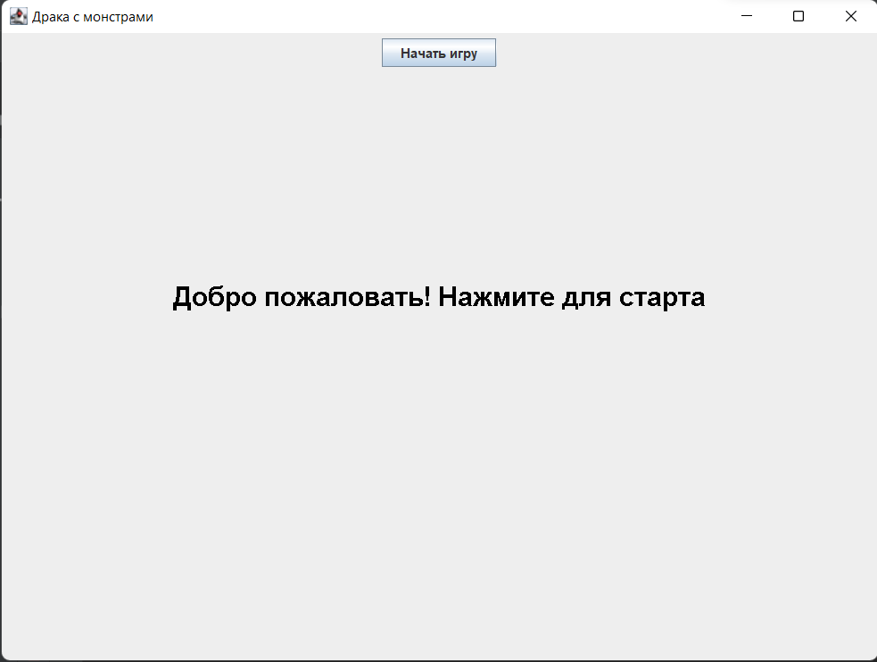
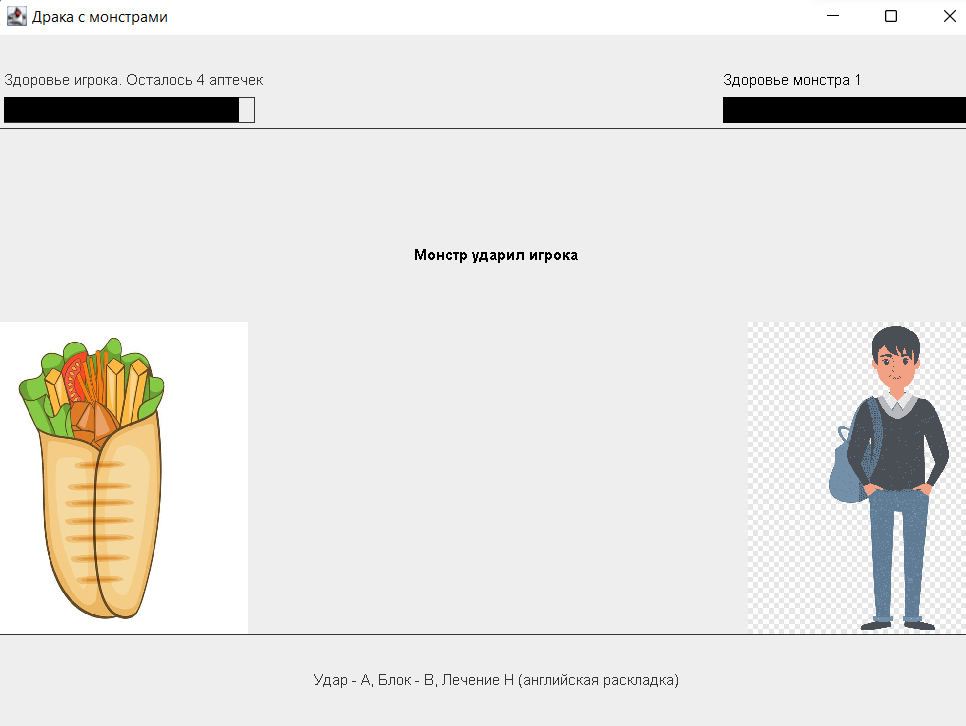

# Тестовое задание для поступающих в школу разработки Heads x Hands

## Telegram [usoltsev_k](https://t.me/usoltsev_k)

### Суть игры

В игре игроку придется сыграть за шаверму, которая будетзащищаться от голодных студентов. Чтобы остаться несъеденной. Шаверма может подлечиться с помощью 4-х порций соуса, которые восстановят 30% здоровья.

### Управление

В игре есть 3 действия: Удар, Блок и Хилл.

- A - атака
- B - блокирование
- H - хилл

### Скриншоты игры

Главный экран

Экран драки
